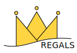

# `REGALS`

Software package for small angle X-ray scattering (SAXS) mixture deconvolution by REGularized Alternating Least Squares. It has been applied to datasets from chromatography-coupled SAXS, time-resolved SAXS, and equilibrium titrations. See our paper ([1]) for details.

## Repository Contents

- `matlab/` - MATLAB implementation of the REGALS library
- `python/` - Python 3 implementation of the REGALS library
- `demo/` - Notebooks for processing example data (Jupyter for python, Live notebooks for MATLAB). See [demo/README.md](demo/README.md).
- `license.md` - software license

## System Requirements

#### Hardware

This depends on the size of the dataset. The examples included in `demo/` run quickly on a desktop computer (< 1 minute).

#### Software dependencies

The MATLAB implementation was developed in R2018a (version 9.4). No toolboxes are required.

The Python implementation was developed in Python 3. The REGALS library requires `numpy` and `scipy`. The demos use Jupyter notebooks with `h5py` for data import and `matplotlib` for plotting. The code has been tested with the following versions:
- `python`: 3.8.3
- `numpy`: 1.18.5
- `scipy`: 1.5.0
- `jupyterlab`: 2.1.5
- `h5py`: 2.10.0
- `matplotlib`: 3.2.2

## Installation Guide

Download the repository and install software dependencies if needed.

## Demonstration

See [demo/README.md](demo/README.md).

## Instructions for use

To get started using REGALS:

**MATLAB**: Copy an appropriate example script from `demo/`, and open using the live editor. Make sure the `matlab/` directory has been added to your path. Edit the script as needed for your dataset.

**Python**: Create a python 3 environment with the necessary libraries. Copy an appropriate example script from `demo/`, and open it using jupyter. Make sure the `python/` directory has been added to the path. Edit the script as needed for your dataset.

For a full description of the REGALS method refer to our paper [1] and the included demos.

## References

[1]: https://doi.org/???/
(1) Meisburger, S.P., Xu, D. & Ando, N. REGALS method to deconvolve X-ray scattering data from evolving mixtures. BioRxiv (2020). https://doi.org/???/
